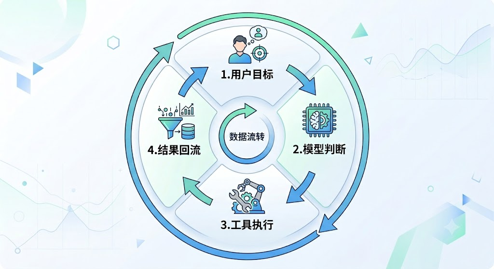
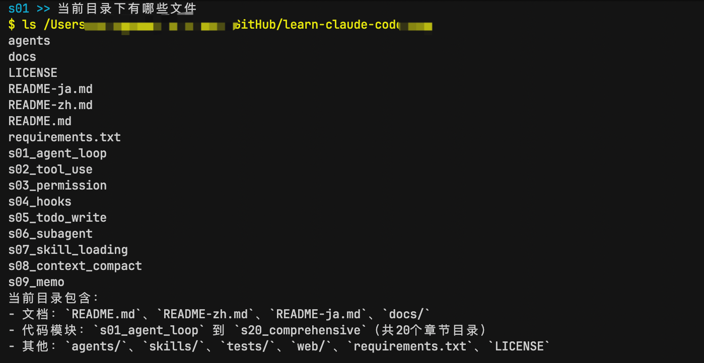

# 刚开始学 Agent，我先用 30 行 Python 跑通了最小闭环

> 模型会写命令，不等于模型会做事。中间差的，常常不是能力，是一个把结果送回去的循环。

我最近开始顺着 `learn-claude-code` 这套教程看 Claude Code 的实现原理。

第一节就挺好，因为它不跟你先聊一大堆概念，而是直接把最小的那条执行回路摊开来看。

任务拆解、长期记忆、权限系统、工作流、子 Agent、多 Agent 协作，这些后面当然都重要。可如果一开始就先扎进这些东西里，人很容易越学越重，最后连最基本的那条执行回路都没亲手跑通。

而这一节刚好相反，它只盯最小的那块东西。

让模型说完命令之后，不是停在那儿，而是真的把命令跑掉，再把结果塞回去。

看着不大。

但很关键。

所以这篇文章你可以把它当成我这段学习过程里的一个整理。我不聊大而全，也不聊花里胡哨的架构，就把这个最小可用的 Agent Loop 拆开讲清楚。

跑完之后，你手里会有一个能在终端里工作的东西。你给它一句话，它会决定要不要调用 Bash，调用完看结果，再决定下一步。

---

## 先别急着谈 Agent，先看它到底卡在哪

大模型其实很会写命令。

你让它列目录，它能写 `ls`。

你让它执行脚本，它能写 `python xxx.py`。

你让它创建文件，它连重定向命令都能给你拼出来。

看起来已经很像一个会干活的助手了。

但这里有个特别关键的小断点。

它写出来了，不代表它做了。

命令不会自己执行，终端输出也不会自己回到上下文里。于是整个过程会变成这样。

模型给你一条命令。

你手动复制。

你去终端运行。

你把结果贴回来。

模型再继续说下一句。

这个时候，真正串起整个执行链的人，其实是你。

也就是说，很多所谓的「模型不会行动」，不是模型完全不会，而是外层那段把动作和反馈连起来的东西，还没搭起来。

说到底，模型离真正做事，往往就差一个会回头的回路。

---

## 所谓 Agent Loop，其实就是把这条回路接上

如果把这件事压到最简单，它其实只有四个角色。

```text
用户目标 -> 模型判断 -> 工具执行 -> 执行结果回流
```

这条链子里，最容易被低估的是最后一段。

执行结果回流。

因为模型真正需要的，不只是能调用工具，而是能看见工具调用之后发生了什么。

你想想看。

如果它调用了 Bash 去执行脚本，拿到的不是空白，而是真实的 stdout、stderr、退出状态，那它下一轮的推理就不一样了。它不是在凭感觉接着说，而是在根据外部世界给它的反馈继续推进。

这才像行动。

不是光会建议。

这一点很重要，你先记住。

Agent 不是工具列表。

Agent 是一条能反复闭环的执行链。



---

## 为什么第一节先讲最小版本，反而是对的

我很喜欢这种教学方式，先做一个有点傻、但是真的能工作的版本。

不追求一开始就完整。

先追求能跑。

这个最小版本只做两件事。

第一，给模型一个工具，Bash。

第二，只要模型还在要工具，就继续跑下一轮。

没有调度系统。

没有复杂权限树。

没有花哨的任务图。

甚至连工具都只有一个。

但这恰恰是它最好的地方。你会非常清楚地看到，Agent 的骨架到底在哪里。

很多工程问题，一旦从最小结构开始看，就不容易糊涂。

---

## 真动手之前，先把运行环境搞定

这份 demo 会真的执行模型生成的 shell 命令，所以别直接在你最重要的项目目录里玩。

稳一点，单独开个测试目录。

或者就在这个仓库里只跑示例，不做别的操作。

准备动作不多。

```bash
pip install anthropic 
pip install python-dotenv
pip install pyyaml
cp .env.example .env
```

然后打开 `.env`，把 `ANTHROPIC_API_KEY` 和 `MODEL_ID` 填进去。

如果你本地不是直接连官方接口，而是走了自己的代理地址，这份代码也考虑到了，会读取 `ANTHROPIC_BASE_URL`。这个细节挺实在的，不然很多人环境变量一混，前面半小时全在排错。

---

## 先看整份代码的骨架

它其实就是四步。

准备环境。

定义工具。

实现工具执行。

把执行和反馈放进主循环，也就是说，用一个 `while True` 把整套流程串起来，让模型调用工具、拿到结果、继续下一轮。

如果把实现细节先折起来，只看骨架，大概就是这个样子。

```python
# 1. 准备依赖和环境
import os
import subprocess
...

# 2. 定义模型能用的工具
TOOLS = [
    {"name": "bash", ...}
]

# 3. 实现工具执行

def run_bash(command: str) -> str:
    ...

# 4. 用主循环把模型、工具和结果回流串起来

def agent_loop(messages: list):
    while True:
        response = client.messages.create(...)
        ...
```

---

## 对着骨架里的第 2 步看，先把第一只手交给模型

很多人做 Agent，天然会有一种冲动。

既然都做了，那不如把读文件、写文件、搜索、编辑、联网、浏览器控制一次性都塞进去。

听着很合理。

但真到教学和理解阶段，这么搞通常没什么好处。

因为工具一多，注意力就散了。你会分不清到底是哪个环节让系统开始像 Agent，哪个环节只是锦上添花。

所以这个示例非常克制，它先只给 Bash。

```python
TOOLS = [{
    "name": "bash",
    "description": "Run a shell command.",
    "input_schema": {
        "type": "object",
        "properties": {"command": {"type": "string"}},
        "required": ["command"],
    },
}]
```

工具的定义：

名字是什么。

能干什么。

输入长什么样。

其中，能干什么，尤其重要。

模型靠这个判断，自己现在有没有这个能力，什么时候该用，怎么用。描述太虚，模型就容易装懂，或者乱试。描述够直，它用起来就稳很多。

---

## 对着骨架里的第 3 步看，工具定义完了，还得有人真去跑它

有了工具定义，还不够。

得有人真的去执行。

这个角色在示例里很明确，就是 `run_bash`。

```python
def run_bash(command: str) -> str:
    dangerous = ["rm -rf /", "sudo", "shutdown", "reboot", "> /dev/"]
    if any(d in command for d in dangerous):
        return "Error: Dangerous command blocked"
    try:
        r = subprocess.run(
            command,
            shell=True,
            cwd=os.getcwd(),
            capture_output=True,
            text=True,
            timeout=120,
        )
        out = (r.stdout + r.stderr).strip()
        return out[:50000] if out else "(no output)"
    except subprocess.TimeoutExpired:
        return "Error: Timeout (120s)"
    except (FileNotFoundError, OSError) as e:
        return f"Error: {e}"
```

这一步依赖的东西是 `subprocess.run`，再加上当前工作目录、超时、输出捕获这些执行参数。

值得注意的是它怎么处理细节。

先拦几类一看就不想放出去的命令。

再给执行时间上个闹钟，别一条命令挂在那里把整轮都拖死。

stdout、stderr 一起拿回来。

没有输出，也老老实实告诉模型，现在就是空的。

---

## 对着骨架里的第 4 步看，真正让它像 Agent 的，是最后这个主循环

真正的核心代码在这。

```python
def agent_loop(messages: list):
    while True:
        response = client.messages.create(
            model=MODEL,
            system=SYSTEM,
            messages=messages,
            tools=TOOLS,
            max_tokens=8000,
        )

        messages.append({"role": "assistant", "content": response.content})

        if response.stop_reason != "tool_use":
            return

        results = []
        for block in response.content:
            if block.type == "tool_use":
                print(f"\033[33m$ {block.input['command']}\033[0m")
                output = run_bash(block.input["command"])
                print(output[:200])
                results.append({
                    "type": "tool_result",
                    "tool_use_id": block.id,
                    "content": output,
                })

        messages.append({"role": "user", "content": results})
```

如果按实现顺序看，这一段做的事其实很清楚。

先把当前消息发给模型。

模型回一轮内容。

如果里面有工具调用，就进入执行。

执行完把结果包成 `tool_result`。

再把这些结果塞回消息列表，继续下一轮。

这里依赖的前提也正好是前两步已经准备好的东西，前面定义好的 `TOOLS`，还有刚写好的 `run_bash`。

所以它不是孤零零的一段主循环，而是站在前面两步之上的最后拼装。

模型要动作，那我就负责接住动作。模型停了，我就停。模型还没停，我就继续把结果送回去。外层程序就干一件事，维持这条回路别断。

---

## 这套东西什么时候继续，什么时候停

这个判断条件很简单。

```python
messages.append({"role": "assistant", "content": response.content})
if response.stop_reason != "tool_use":
    return
```

但它刚好就是这份最小 demo 的收口点。

模型如果这轮还在要工具，那外层程序就别停，接着干。

模型如果不再要工具了，那这一轮就收住。

---

## 最后再补几个不影响主线，但很实用的小细节

前面几步是主线。

这后面这些，算边角细节。

比如代码里专门处理了 macOS 下中文输入的退格问题。

```python
import readline
readline.parse_and_bind('set bind-tty-special-chars off')
readline.parse_and_bind('set input-meta on')
readline.parse_and_bind('set output-meta on')
readline.parse_and_bind('set convert-meta off')
```

如果你平时喜欢直接在终端里输中文，这几行会让体验顺手很多。

很多人可能不知道，这种交互小坑一旦不处理，整套 demo 明明逻辑没问题，实际用起来却总让人觉得拧巴。

还有一个细节是，代码里会把模型要执行的命令打印成黄色。这个设计不影响主流程，但真跑起来的时候特别有帮助。你能直接看到，模型这轮脑子里冒出来的动作是什么，而不是只看一个事后总结。

---

## 真跑一遍，你马上就知道它和普通问答不是一回事

运行命令很简单。

```bash
python code.py
```

你可以试这几个 prompt。

1. `Create a file called hello.py that prints "Hello, World!"`
2. `List all Python files in this directory`
3. `What is the current git branch?`

真跑的时候，你别急着盯最后那句回答。

中间过程其实更有看头。

代码会把模型要执行的命令打印成黄色，这个设计很简单，但特别有帮助。你能直接看到，模型这轮脑子里冒出来的动作是什么，而不是只看一个事后总结。

命令一跑完，输出又会立刻被塞回下一轮上下文。

这时候感觉就出来了。

模型不是在那儿顺着惯性往下说，它是在看了一眼现场之后，再决定下一步。

比如你让它建一个文件，它未必只动一次。有时候它会先创建，再顺手检查一下内容，确认没问题了再回你。你看到这一套动作连起来的时候，会很明显感觉到，这玩意儿开始有点像个会干活的东西了。

不是只会说，是更会做。



---

## 这 30 行已经够值得反复看了

因为它已经把 Agent 最关键的三样东西搭出来了。

目标。

动作。

反馈。

用户输入是目标。

Bash 是动作接口。

`tool_result` 是反馈回路。

只要这三样东西连起来，后面很多你熟悉的能力，其实都只是叠加层。

增加读写文件能力，是让动作接口更丰富。

增加权限系统，是给动作接口加边界。

增加 hooks，是让外部逻辑可以在循环周围插进去。

增加 TodoWrite、Subagent、Memory，也是在这个骨架外面继续挂东西。

所以很多时候，最值得先搞明白的，不是功能菜单有多长，而是骨架到底长什么样。

骨架看明白了，后面再长肉。

顺序别反。

---

## 真到了生产里，复杂度会从哪儿一点点冒出来

这个问题也挺值得顺手聊一下。

像 Claude Code 这种成熟产品，核心当然不止这 30 行，但它的出发点其实还是一样的。

差别主要长在保护机制上。

比如这个 demo 用 `stop_reason == "tool_use"` 判断是不是继续，在教学里完全够用。

可一旦到了流式响应场景，事情会变得没这么简单。你有可能已经收到了工具调用块，但 `stop_reason` 还没同步到最终状态。

这时候如果还死盯这个字段，就可能判断失误。

所以更完整的实现，往往会直接去看响应内容里有没有 `tool_use` 块，而不只是看一个状态字段。

再往后，还会自然冒出更多问题。

危险操作要不要拦。

上下文太长了怎么办。

工具执行失败以后要不要重试。

长任务能不能丢到后台。

多个 Agent 一起干活时怎么隔离目录，怎么通信。

这些都是真的工程问题。

但反过来说，也正因为这些问题都是真的，所以更不能一开始就一股脑扑上去。你得先有一条能工作的主干，不然后面加的所有机制，最后只会越堆越乱。

回到这篇文章最开始那句话。

模型会写命令，不等于模型会做事。

真正让它开始做事的，不是多聪明一层提示词，而是你有没有把动作和反馈这条线接上。

一旦接上。

哪怕只有 30 行。

东西也会突然活过来。

---

## 完整代码

如果你想直接看完整实现，可以打开这里。

- https://github.com/ZhangXj93/learn-claude-code/blob/main/practice/s01_agent_loop/agent.py

如果你准备继续往下学，下一步很自然就是 Tool Use。因为当你已经能让模型借助一个工具连续行动，下一个问题通常就是，怎么把它从一只手，慢慢长成一套顺手的工具系统。

我自己也还在继续顺着 `learn-claude-code` 往后学，如果你也在学这一块，希望这篇能帮你少绕一点路。

以上，既然看到这里了，如果觉得有用，随手点个赞、在看、转发三连吧，如果想第一时间收到推送，也可以给我个星标⭐～

谢谢你看我的文章，我们，下次再见。

> / 作者，同学小张
